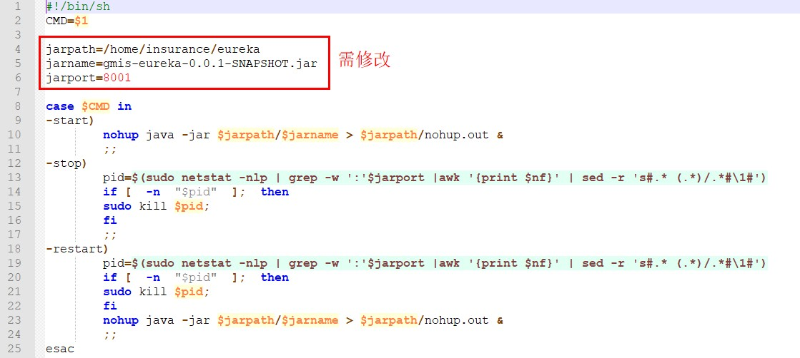

# 创建shell文件

  
gmis-eureka8011.sh

1. jarpath：更改jar包路径
2. jarname：更改jar包名称
3. jarport：更改端口号
4. 存放位置：/root/insurance/syseureka/ gmis-eureka8011.sh

# 创建service

  
gmis-eureka8011.service

1. 蓝色：更改service文件描述，可选
2. 红色：更改上一步创建的sh文件路径
3. 存放位置：/usr/lib/systemd/system/gmis-eureka8011.service

# 命名规则

1. sh和service命名规则：jar包的模块名+端口号
1. jar包存放路径：/root/insurance/syseureka/gmis-eureka-0.0.1-SNAPSHOT.jar
1. sh和service文件名：gmis-eureka8011.sh 、gmis-eureka8011. Service

> Jar包和sh文件存放在同一目录
> Service文件存在在/usr/lib/systemd/system目录下

# 命令

**设置开机启动**
systemctl enable gmis-eureka8011.service

**取消开机启动**
systemctl disable gmis-eureka8011.service 

**查看状态**
systemctl status gmis-eureka8011.service

**启动**
systemctl start gmis-eureka8011.service

**停止**
systemctl stop gmis-eureka8011.service

**重启**
systemctl restart gmis-eureka8011.service

# 异常

**service文件报错：**
Warning: gmis-eureka8011.service changed on disk. Run 'systemctl daemon-reload' to reload units.  
解决：  
systemctl daemon-reload  
说明：  
新添加或者更改了service文件的unit配置之后需要重新加载 systemd 程序的配置文件  

**sh文件报错：**
$'\r': 未找到命令  
Job for gmis-eureka8011.service failed because the control process exited with error code. See "systemctl status gmis-eureka8011.service" and "journalctl -xe" for details.  
解决方案1：  
安装yum install dos2unix  
进入到sh文件的目录执行：dos2unix gmis-eureka8011.sh  
说明：是因为命令直接从windows 复制过来导致的，在windows下编辑sh文件会导致与linux编码不同，需要执行dos2unix，如果使用notepad++在unix格式下编辑好sh文件之后直接通过sftp传到linux上的时候不存在该问题  
解决方案2：   
1.vim file.sh 编辑sh文件  
2.输入命令修改sh文件格式为unxi格式:set ff=unix  

